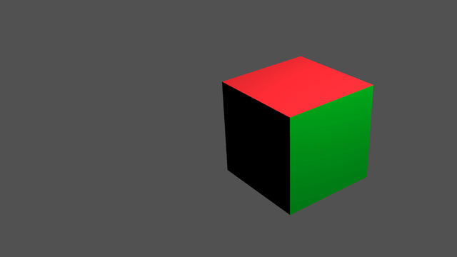
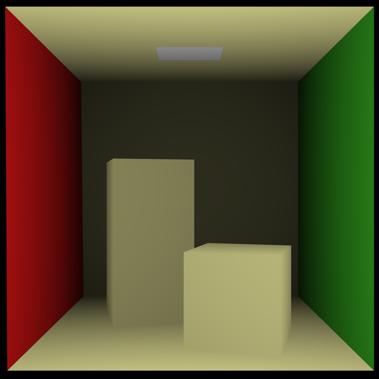

# Renderer
Prototype implementations of unbiased renderers.



## Next

* Path Tracer with Monte Carlo Sampling
* Metropolis Light Transport
* Radiosity Rendering

## Done

### Raycasting



Generated with:
```(bash)
./raycaster scenes/cornell_box.blend 640 | convert - scenes/cornell.png
```

We just use the distance to the eye of the camera as a light measure. So there
is no real lighting.

## Raytracing


Generated with:
```(bash)
./raytrace scenes/cornell_box.blend -w 3840 --max-depth 3 > cornell.pbm
convert -resize 640x640 -interpolate bicubic cornerll.pbm cornell.png
```

We don't load material information yet. Every surface has the same reflectance.
Resizing the image is a simple antialiasing method.

## Thanks
* Sean Barrett for [stb](https://github.com/nothings/stb)'s image writer
