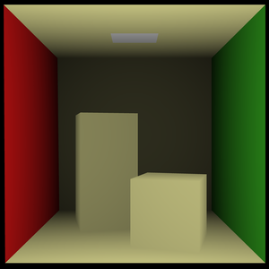
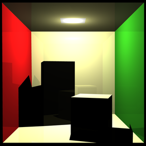
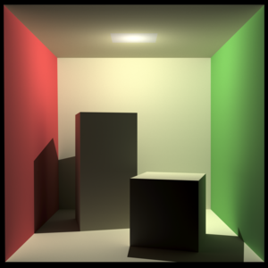

[](https://waffle.io/blacklab/renderer)

# Renderer [](https://travis-ci.org/blacklab/renderer) [](https://coveralls.io/github/blacklab/renderer?branch=master)
Prototype implementations of unbiased renderers.


## Build

```
make bootstrap  # download and build dependencies
make            # build renderers
make test       # optional: run tests
```

## Next

* Path Tracer with Monte Carlo Sampling
* Metropolis Light Transport
* Radiosity Rendering

## Done

### Raycasting

[](scenes/cornell_raycast.png)

Generated with:
```(bash)
./raycaster scenes/cornell_box.blend 3840 > cornell.pbm
convert -resize 640x640 -interpolate bicubic cornell.pbm cornell.png
```

We just use the distance to the eye of the camera as a light measure. So there
is no real lighting.


[](scenes/cornell_raytrace.png)

Generated with:
```(bash)
./raytracer scenes/cornell_box.blend -w 3840 --max-depth 3 > cornell.pbm
convert -resize 640x640 -interpolate bicubic cornell.pbm cornell.png
```

We don't load material information yet. Every surface has the same reflectance.
Resizing the image is a simple antialiasing method.

## Pathtracing

[](scenes/cornell_box_pathtrace_3480_4_128.png)

Generated with:
```(bash)
./pathtracer scenes/cornell_box.blend -w 3480 --max-depth 3 -m 4 --pixel-samples 128 > cornell_box_3480_3_4_128.pbm
convert cornell_box_3480_3_4_128.pbm cornell_box_3480_3_4_128.png
```

Overall brightness is corrected in an external program. Since we are using a point light, the original picture is slightly too dark. The rendering time on 8 cpus was ~28 hours.

## Model

The cornell box is modeled in Blender using the specifications on
http://www.graphics.cornell.edu/online/box/data.html. The camera and distances
are exactly the same. The colors may be different, since we did not transform
the original color definitions from the spectral space to rgb. Feel free to use
it in your projects.

[cornell_box.blend](scenes/cornell_box.blend)

## Algorithm Implementations from Scratch

The following algorithm have been implemented from scratch. While most are not
that complicated it is good practice and gives a nice overview of all things
required for rendering.

- [x] Xorshift64*
- [x] Lambertian Reflectance
- [x] Ray-Triangle Intersection after [Dan Sunday](http://geomalgorithms.com/a06-_intersect-2.html)
- [x] Barycentric Interpolation
- [x] Monte Carlo Integration for Hemisphere Sampling
- [x] Polar Coordinates to Cartesian Coordinates
- [ ] KD-Tree

## Thanks
* Sean Barrett for [stb](https://github.com/nothings/stb)'s image writer
