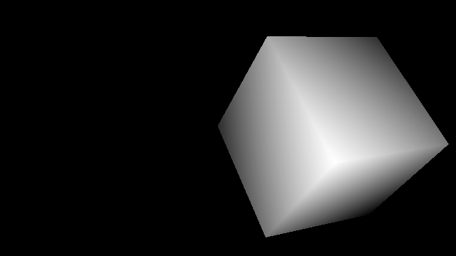

# Renderer
Prototype implementations of unbiased renderers.

## Next

* Ray Tracer
* Path Tracer with Monte Carlo Sampling
* Metropolis Light Transport
* Radiosity Rendering

## Done

### Raycasting

Thanks to the help of [my friend](https://github.com/boxdot). We just use the
distance to the eye of the camera as a light measure. So there is no real lighting.

## Thanks
* Sean Barrett for [stb](https://github.com/nothings/stb)'s image writer
